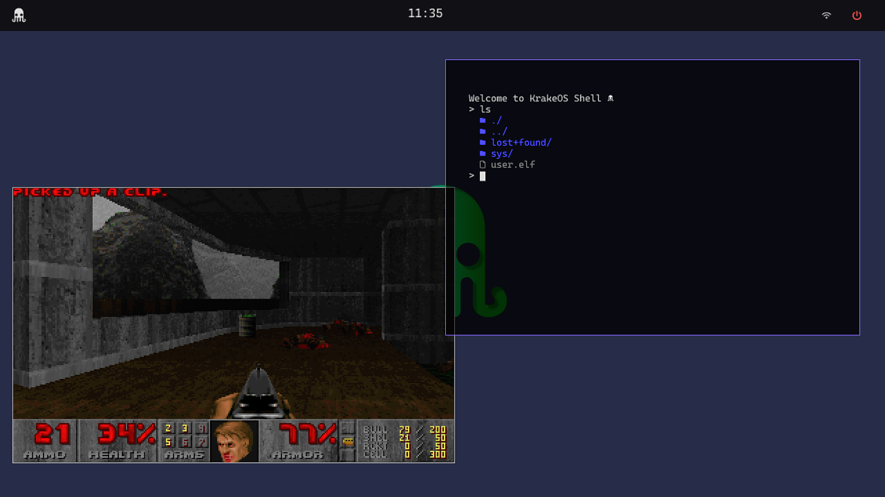

<div align="center">
<br>
<br>


# 🦑 KrakeOS

**A 64-bit Microkernel-ish Operating System written in Rust**

[](https://www.rust-lang.org/)
[](https://en.wikipedia.org/wiki/X86-64)
[](https://webassembly.org/)
[](https://opensource.org/licenses/MIT)

<br>

<p align="center">
  <strong>KrakeOS</strong> is a modern, open-source <strong>operating system kernel</strong> built from scratch using the <strong>Rust programming language</strong>. Designed for <strong>OS development</strong> research, it features a custom <strong>microkernel architecture</strong>, a native <strong>WebAssembly (WASM) Component Model runtime</strong>, and a hardware-accelerated <strong>compositing window manager</strong>.
</p>



<br>

*Exploring the intersection of Safe Systems Programming, WebAssembly, and Graphical User Interfaces.*

</div>

---

## 📑 Table of Contents

- [Overview](#-overview)
- [Key Features](#-key-features)
  - [Core Architecture](#-core-architecture)
  - [Graphics & Windowing](#-graphics--windowing)
  - [WebAssembly Runtime](#-webassembly-runtime)
  - [Filesystem & Drivers](#-filesystem--drivers)
  - [Userland](#-userland)
- [Building & Running](#-building--running)
- [Contributing](#-contributing)
- [License](#-license)

---

## 📖 Overview

KrakeOS is a hobbyist **64-bit operating system** written in **Rust**, targeting the x86_64 architecture (Long Mode). Unlike traditional kernels, KrakeOS prioritizes **WebAssembly (WASM)** as a first-class citizen, integrating a built-in **WASI Preview 2** compliant runtime directly into the system.

This project serves as an advanced educational resource for understanding **kernel development**, **driver implementation**, and **memory management** in Rust. It combines a custom bootloader, preemptive multitasking, and a compositing window manager into a unique platform for systems research.

## ✨ Key Features

### ⚙️ Core Architecture
*   **x86_64 Long Mode:** A fully 64-bit kernel and userland environment.
*   **Preemptive Multitasking:** Robust round-robin scheduler supporting lightweight threads and process isolation.
*   **Hybrid Memory Management:**
    *   **Paging:** 4-level Paging (PML4) implementation with higher-half kernel mapping.
    *   **Heap Allocation:** Dynamic heap allocator using linked-list strategies with merging.
    *   **PMM:** Physical Memory Manager (Frame Allocator) for efficient resource tracking.
*   **System Calls:** High-performance `syscall`/`sysret` interface implementation with over 30 syscalls.

### 🎨 Graphics & Windowing
*   **Compositing Window Manager:** A custom in-kernel compositor featuring:
    *   **Visual Effects:** Alpha blending, transparency, and z-ordering.
    *   **Performance:** SIMD-optimized (SSE/AVX) blitting for fast rendering.
    *   **Interactivity:** Window dragging, resizing, focus management, and event handling.
*   **VirtIO GPU Driver:** Hardware-accelerated 2D graphics support with hardware cursor integration.
*   **InkUI:** A bespoke, lightweight **GUI widget library** written in Rust for building native applications.

### 🕸️ WebAssembly Runtime
KrakeOS distinguishes itself with a sophisticated embedded **WASM runtime**:
*   **WASI Support:** Full support for **WASI Preview 1 & 2**, enabling standard WASM applications to run natively.
*   **Component Model:** Native implementation of the **WASM Component Model**, allowing for modular, composable, and language-agnostic applications.
*   **Integrated Interpreter:** A custom-built WASM interpreter integrated directly into the `std` library for seamless execution.

### 💾 Filesystem & Drivers
*   **Ext2 Filesystem:** Complete Read/Write support with directory iteration, inode management, and caching.
*   **Virtual Filesystem (VFS):** A unified interface abstracting devices, files, and IPC pipes.
*   **Hardware Drivers:**
    *   **Storage:** VirtIO Block Device & Legacy IDE/ATA (PIO/DMA modes).
    *   **Input:** PS/2 Keyboard & Mouse driver with scroll wheel support.
    *   **Bus:** Full PCI enumeration and configuration.

### 🖥️ Userland
*   **Custom Standard Library:** A rich, Rust-like `std` library providing FS, IO, Threading, and WASM bindings for user applications.
*   **Shell:** An interactive CLI shell supporting pipes (`|`), logical operators (`&&`), environment variables, and command history.
*   **Native Applications:**
    *   **Term:** A graphical terminal emulator with ANSI escape code support.
    *   **Taskbar:** A reactive system taskbar for window management.
    *   **Sysmon:** Real-time system resource monitor.
    *   **DOOM:** Ported and running natively on KrakeOS.

## 🛠️ Building & Running

KrakeOS uses a streamlined build process leveraging **Cargo** and **QEMU**.

### Prerequisites
*   **Rust Nightly Toolchain:** Required for OS-level features.
*   **QEMU System (x86_64):** For emulation.
*   **LLVM Tools:** `clang`, `llvm-ar` (for compiling C dependencies).
*   **WSL:** Recommended if building on Windows.

### Quick Start

Clone the repository and run the following commands:

```bash
# Build the kernel, userland, and generate the disk image
make build

# Launch the OS in QEMU
make run
```

## 🤝 Contributing

Contributions are welcome! Whether it's fixing a bug in the Ext2 driver, optimizing the window compositor, or adding new WASI syscalls, feel free to open a Pull Request.

1.  **Fork** the repository.
2.  Create your **feature branch** (`git checkout -b feature/amazing-feature`).
3.  **Commit** your changes (`git commit -m 'Add some amazing feature'`).
4.  **Push** to the branch (`git push origin feature/amazing-feature`).
5.  Open a **Pull Request**.

## 📜 License

Distributed under the MIT License. See `LICENSE` for more information.

<br>
<div align="center">
  <sub>Built with ❤️ in Rust</sub>
</div>